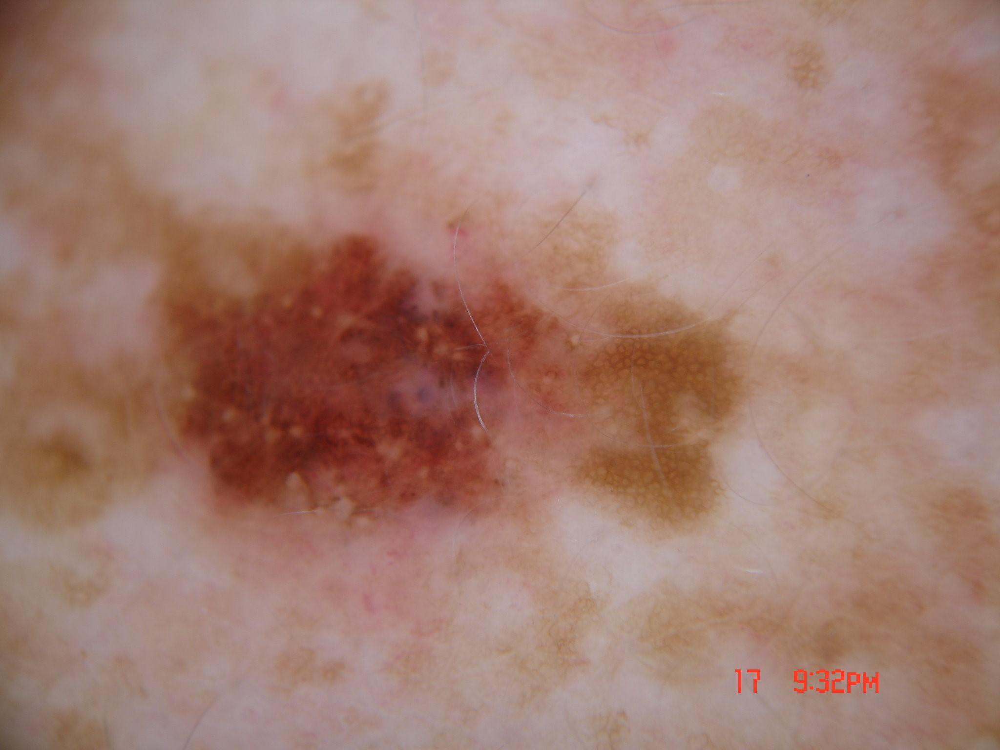
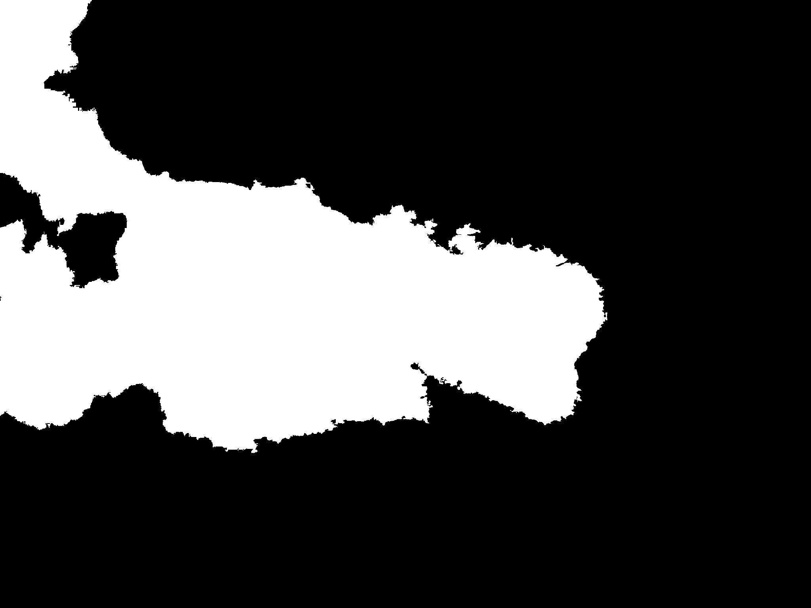
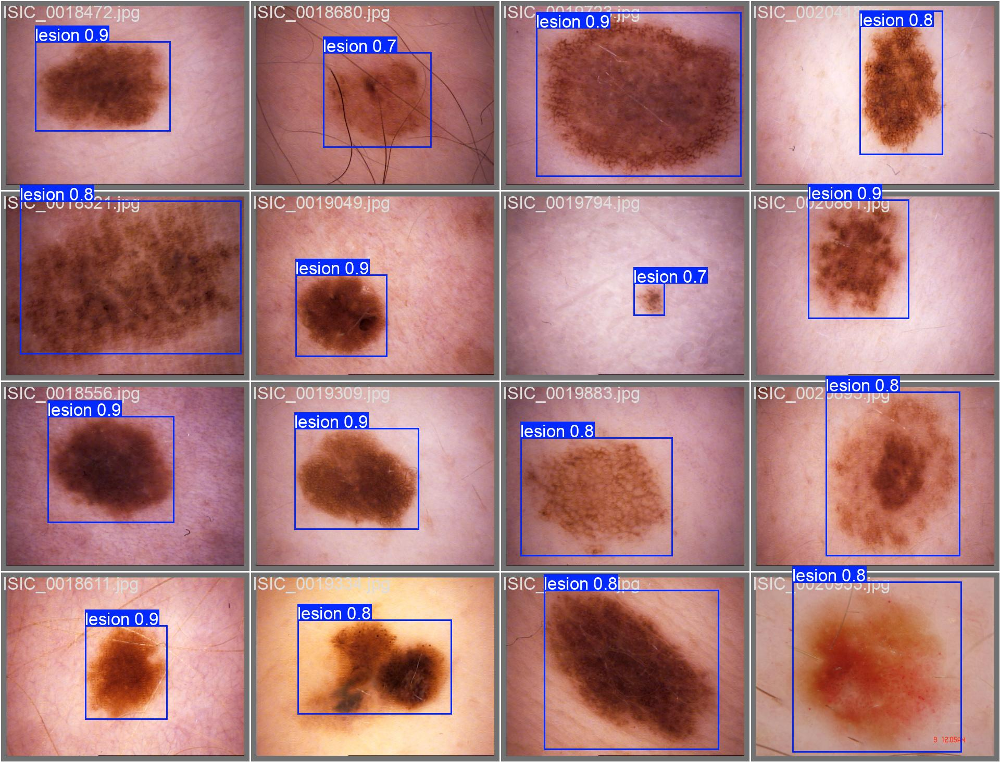
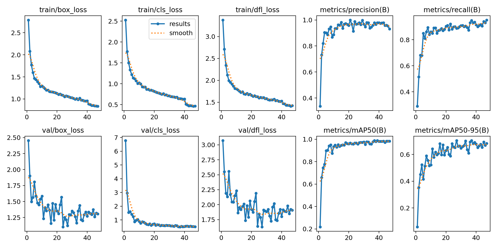
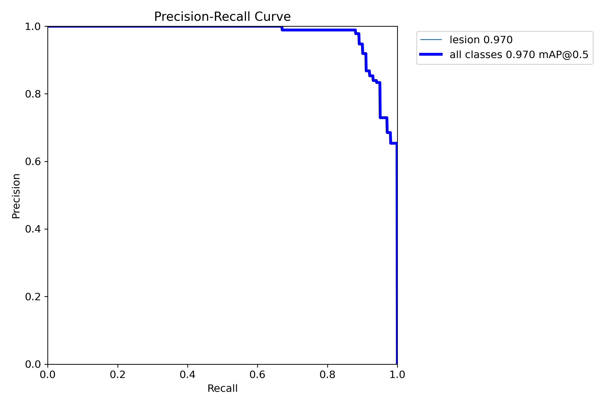
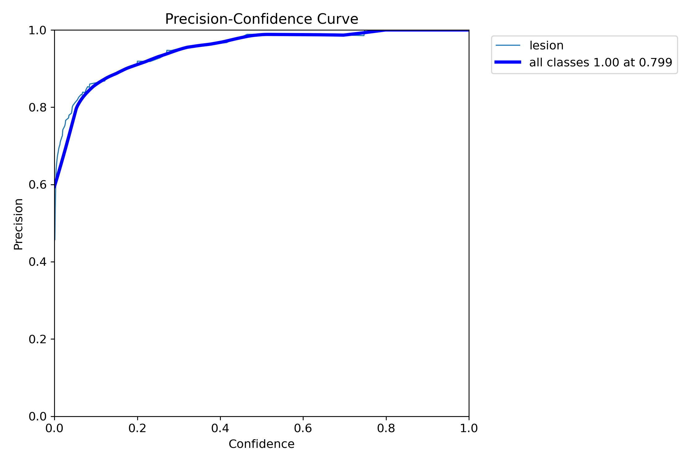
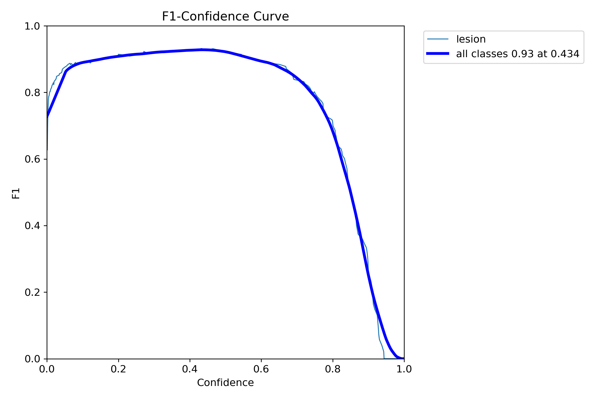
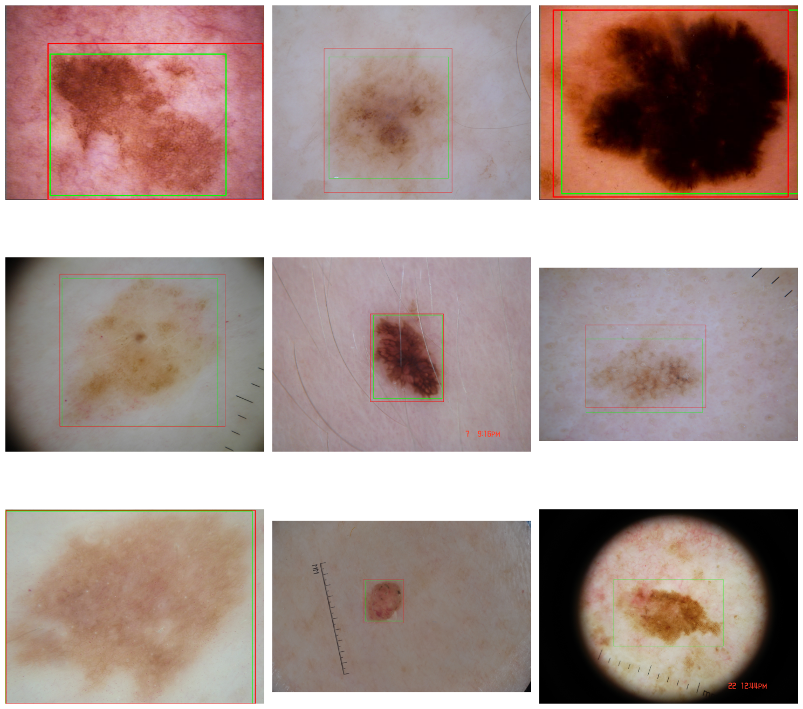
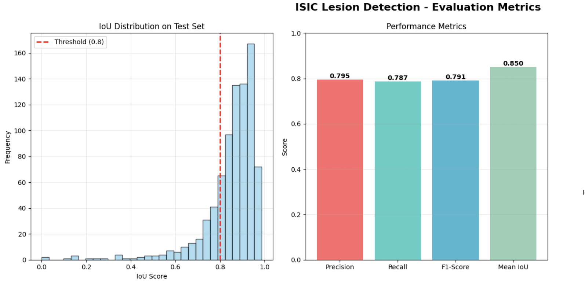
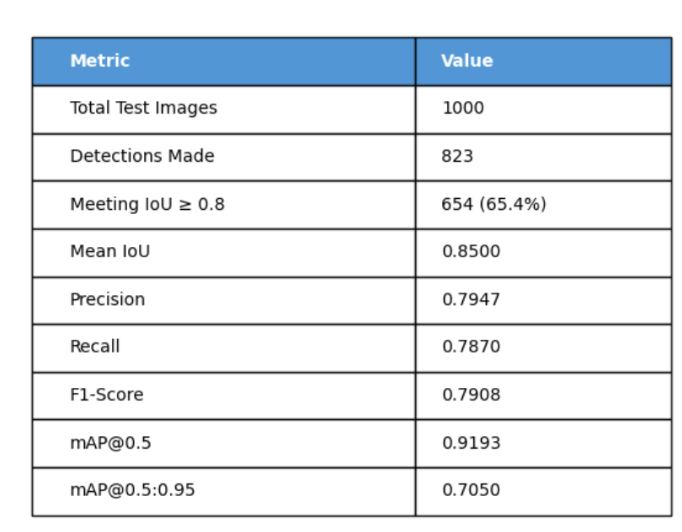

# Skin Lesion Detection using ISIC 2018 dataset based on YOLO architecture

## Problem

According to the Skin Cancer Foundation, more than 9,500 people are diagnosed worldwide with skin cancer every day. This presents the need for accurate and precise procedures to identify and detect lesions in medical imaging. The following report focuses on training and evaluating a YOLO model to detect and classify skin lesions from the ISIC 2018 dataset with the aim of achieving an IoU greater than 0.8. In this report a pretrained YOLOv8 model on the COCO dataset would be finetuned to detect and classify skin lesions

## Dataset

The 2018 ISIC dataset can be downloaded from the following link: [ISIC 2018](https://challenge.isic-archive.com/data/#2018).  
The folder structure is showcased below:

```bash
ISIC_2018/
├── ISIC2018_Task1-2_Training_Input_x2/
│   ├── ISIC_000001.jpg
│   ├── ISIC_000002.jpg
│   └── ...
│
├── ISIC2018_Task1_Training_GroundTruth_x2/
│   ├── ISIC_000001_segmentation.png
│   ├── ISIC_000002_segmentation.png
│   └── ...
│
├── ISIC2018_Task1-2_Validation_Input/
│   ├── ISIC_002195.jpg
│   ├── ISIC_002196.jpg
│   └── ...
│
├── ISIC2018_Task1_Validation_GroundTruth/
│   ├── ISIC_002195_segmentation.png
│   ├── ISIC_002196_segmentation.png
│   └── ...
│
├── ISIC2018_Task1-2_Test_Input/
│   ├── ISIC_002295.jpg
│   ├── ISIC_002296.jpg
│   └── ...
│
└── ISIC2018_Task1_Test_GroundTruth_2/
    ├── ISIC_002295_segmentation.png
    ├── ISIC_002296_segmentation.png
    └── ...
```

### Dataset Statistics

In total, the dataset contains 3,294 images with the following split derived directly from the ISIC challenge:

- **Training:** 2,194 images
- **Validation:** 100 images
- **Testing:** 1,000 images

**Note on split:** The split is unconventional compared to typical 70/15/15 or 80/10/10 splits. However, this follows the official ISIC challenge distribution. Each folder contains exactly the number of images provided by the organizers. The naming convention ensures that each image (`ISIC_xxxxxxx.jpg`) directly corresponds to its segmentation mask (`ISIC_xxxxxxx_segmentation.png`) in the ground truth folders.

The split is approximately 67/3/30 for training, validation, and testing respectively. The following data and the segmentation maps are shown below



---

## YOLO Architecture

You Only Look Once (YOLO) is a fast object detection algorithm which aims to classify as well as localise objects simultaneously by treating detection as a single regression problem. Unlike traditional algorithms which separate these two tasks, YOLO performs bounding box prediction and object classification in a single pass with extreme speed.

## Working of YOLO


YOLO aims to divide original image into N x N grid of equal sizes. Within the grid, each cell is responsible for localisation of an object as well as predicting the class of the object it covers with a confidence score. Since the ISIC data only contains skin lesions, this is a single class problem with the only class being 'lesion'.

Next, YOLO aims to create bounding boxes, which are rectangular shapes that cover an object. If multiple shapes exist in a given image, there could be multiple bounding boxes. The following is the format for the bounding box:

```
(x_center, y_center, width, height, confidence, class)
```

Where:

- `x_center, y_center`: Center coordinates of the bounding box
- `width, height`: Dimensions of the bounding box
- `confidence`: Probability that the box contains an object
- `class`: Class label (in our case, always 'lesion')

Since there can be multiple grid predictions for a given object, not all may be relevent or necessary. Hence the technique of Intersection Over Union (IoU) aims to filter these. It selects images that are above a certain IoU threshold.

The following is the calculation for IoU:

```
IoU = Area of Overlap / Area of Union
```

Or more formally:

```
IoU = (Area of Predicted Box ∩ Area of Ground Truth Box) / (Area of Predicted Box ∪ Area of Ground Truth Box)
```

Further filtering is required as still multiple boxes for a single object may be present. Therefore Non-Maximum Suppression aims to remove boxes of low confidence, removing redundant predictions of overlap predicting the same object.


---

## Loss Functions

The loss functions in YOLO consist of three seperate losses which are localisation loss, confidence loss and classification loss.

### Localisation Loss

YOLOv8 uses Complete Intersection over Union (CIoU) loss as default. This measures how close the predicted grid for a given object is to the ground truth box. It differs from regular IoU as it considers:

1. **Overlap** - Normal IoU
2. **Center distance** - How far apart the center points of each boxes lie
3. **Aspect ratio consistency** - Similarity in shape between predicted and ground truth boxes

The CIoU loss is calculated as:

$$L_{\text{CIoU}} = 1 - \text{IoU} + \frac{\rho^2(b, b_{gt})}{c^2} + \alpha v$$

Where:

- $\rho^2(b, b_{gt})$: Euclidean distance between center points of predicted and ground truth boxes
- $c$: Diagonal length of the smallest enclosing box
- $\alpha$: Positive trade-off parameter
- $v$: Measures aspect ratio consistency

### Confidence Loss

Confidence loss in each cell predicts the likelihood of it containing an object. The Binary Cross Entropy loss is utilised as shown below using the formula:

$$L_{\text{conf}} = -\left[y_{\text{obj}} \cdot \log(p_{\text{obj}}) + (1 - y_{\text{obj}}) \cdot \log(1 - p_{\text{obj}})\right]$$

Where:

- $y_{\text{obj}}$: Ground truth (1 if object present, 0 otherwise)
- $p_{\text{obj}}$: Predicted confidence score

This loss penalises the model when it predicts high confidence for cells without objects and low confidence for cells with objects.

### Classification Loss

Classification loss measures how accurately the model predicts the class of detected objects. For our single-class problem, this uses Binary Cross Entropy:

$$L_{\text{cls}} = -\left[y_{\text{cls}} \cdot \log(p_{\text{cls}}) + (1 - y_{\text{cls}}) \cdot \log(1 - p_{\text{cls}})\right]$$

Where:

- $y_{\text{cls}}$: Ground truth class label
- $p_{\text{cls}}$: Predicted class probability

Since we only have one class ('lesion'), this loss ensures the model correctly identifies lesions versus background.

The total YOLO loss is a weighted combination of these three components:

$$L_{\text{total}} = \lambda_{\text{loc}} \cdot L_{\text{CIoU}} + \lambda_{\text{conf}} \cdot L_{\text{conf}} + \lambda_{\text{cls}} \cdot L_{\text{cls}}$$

Where $\lambda$ values are weighting factors that balance the contribution of each loss component during training.

## Data preparation

In ISIC2018 dataset, the ground truth masks are segmentation masks, showcasing the skin lesion as white in colour and the background as black. However, this is not acceptable format as for detection and classifcation, bounding boxes need to be calculated. Therefore, the data is preprocessed to calculate bounding boxes around masks and stored in labels subdirectory for each validation, training adn testng ground truths. Furthermore, the images are scaled down to 640 by 640 and normalised in order to increase model speed due to decreased compuration on the smaller images sizes in training. The process of data preparation is done through the file [train.py](./train.py) file.

## Yaml Config

In order to train the model, a yaml configuration is required, which specifies details about the training required for the model. This includes, the dataset paths, the number of classes that are going to be detected as well as their names.

Inside modules.py, the create_yaml function automatically generties this file based on dataset directory structure. Below showcases the content of the yaml file:

```yaml
path: /absolute/path/to/dataset
train: images/train
val: images/val
test: images/test

nc: 1
names: ["lesion"]
```

## Training

The model was trained for 50 epochs with a batch size of 16. During training, the network learned to predict bounding boxes around lesions, optimizing for accurate detection and localization. Metrics such as precision, recall, and F1-score were monitored, and the model weights were saved periodically for evaluation.

After training was finished, the model was evaluated on IoU theshold of 0.8 with the following metrics: IoU, precision, recall and F1-Scores. Below is a detailed evaluation of the model


## Evaluation and Results


The model was trained using default YOLO IoU threshold of 0.5 however evaluation was done with a stricter threshold of 0.8 IoU. This is due to high precision and accuracy of localisation required in medical context.The validation box loss showcases some minor fluctuations due to complex dataset involving irregular skin lesion boundaries. However, in general there is no sign of overfitting as the validation box loss is overall decreasing.







The model achieves a high mAP@0.5 of 0.97 and a peak F1-score of 0.93 at a confidence threshold of 0.43. The Precision–Recall curve demonstrates that the model maintains high precision across varying recall levels, indicating strong detection capability with minimal false positives. The F1–Confidence curve further highlights a good balance between precision and recall, with a broad stable region followed by a sharp decline at higher confidence thresholds, suggesting reliable performance and well-calibrated predictions.

## Prediction


Above showcases the predictions of bounding boxes around skin lesions for testing dataset. The evaluation metrics on IoU threshold is shown below:


It can be seen through IoU distribution of images, that it is positively skewed. Most Images lie above the threshold of 0.8 as shown in the image. Statsitically, approximately 80% images that were detected as positive, had an IoU score of over 0.8 as shown throgh the precision score. Below showcases the extended metrics:



The comprehensive evaluation metrics demonstrate strong model performance:

- Total Test Images: 1,000 images evaluated
- Detections Made: 823 lesions detected (82.3% detection rate)
- Meeting IoU ≥ 0.8: 654 detections (65.4% of total images)
- Mean IoU: 0.8500 – well above the target threshold

At the strict evaluation threshold of IoU ≥ 0.8, the model achieves:

- Precision: 0.7947 (79.47%) – approximately 80% of detected lesions meet the high localization standard, indicating minimal false positives with accurate bounding boxes
- Recall: 0.7870 (78.70%) – the model successfully detects roughly 79% of all lesions in the test set with high localization accuracy
- F1-Score: 0.7908 (79.08%) – excellent balance between precision and recall, demonstrating consistent performance

# Analysis and Discussion

The predictions and results on the test cases showcases the finetuned YOLOv8 model succesfully achieved IoU > 0.8 on majority of the dataset. The mean IoU is approximately 0.85 suggests the model consistently localises the lesion and accurately encompasses skin lesions.

The precision of 0.79 suggests when a lesion is predicted, the model is highly accurate as well as precisely localised. The balance of recall and precision can also be used as a classifcation metrics as its a single class object detection task. The F1-score of 0.79 reflects on the models classifcation results where it avoids flase detection (high precision) and it's able to accuratly detect true lesions (represented by the recall)

Overall, the model is able to correctly classify and detect skin lesions, and majority of the detections have IoU of over 0.8, ideal for the context of medical Imaging.

# Reproducibility

In order to reproduce this research, conduct the following procedure:

1. Download the ISIC 2018 dataset from [ISIC 2018](https://challenge.isic-archive.com/data/#2018).

2. Clone this repository and ensure the folder structure is correct, including the dataset inside the root folder.

Use the following command:

```bash
git clone <repo-url>
cd s48348003_YOLO_ISIC_2018
conda create env
pip install -r requirements.txt
```

3. In order to train the model, run the following command

```bash
python3 train.py
```

4. In order to predict lesions from test folder, run the following command:

```bash
python3 predict.py
```

All the graphs/metrics for validation and training will be aviable in the following directory:

```bash
/runs/detect/
```

## References

1. **Skin Cancer Foundation.** "Skin Cancer Facts & Statistics."  
   [https://www.skincancer.org/skin-cancer-information/skin-cancer-facts/](https://www.skincancer.org/skin-cancer-information/skin-cancer-facts/)

2. **ISIC 2018:** Skin Lesion Analysis Towards Melanoma Detection.  
   [https://challenge.isic-archive.com/data/#2018](https://challenge.isic-archive.com/data/#2018)

3. **Redmon, J., Divvala, S., Girshick, R., & Farhadi, A.** (2016). _You Only Look Once: Unified, Real-Time Object Detection._  
   _Proceedings of the IEEE Conference on Computer Vision and Pattern Recognition (CVPR)._  
   [https://arxiv.org/abs/1506.02640](https://arxiv.org/abs/1506.02640)

4. **Ultralytics.** _YOLOv8 Documentation._  
   [https://docs.ultralytics.com/](https://docs.ultralytics.com/)

5. **Viso.ai.** "YOLOv8: A Complete Guide."  
   [https://viso.ai/wp-content/uploads/2023/12/YOLOv8-Architecture-Structure-1012x1060.jpg](https://viso.ai/wp-content/uploads/2023/12/YOLOv8-Architecture-Structure-1012x1060.jpg) [Image 1]

6. **DataCamp.** "YOLO Object Detection Explained"  
   [YOLO Object Detection Explained](https://www.datacamp.com/blog/yolo-object-detection-explained) [Image 2]
